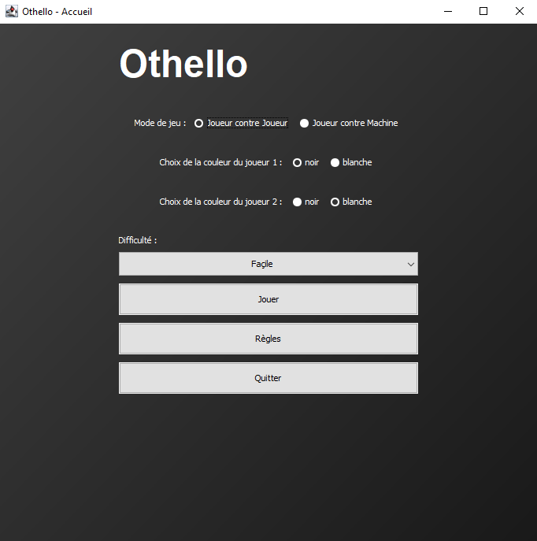
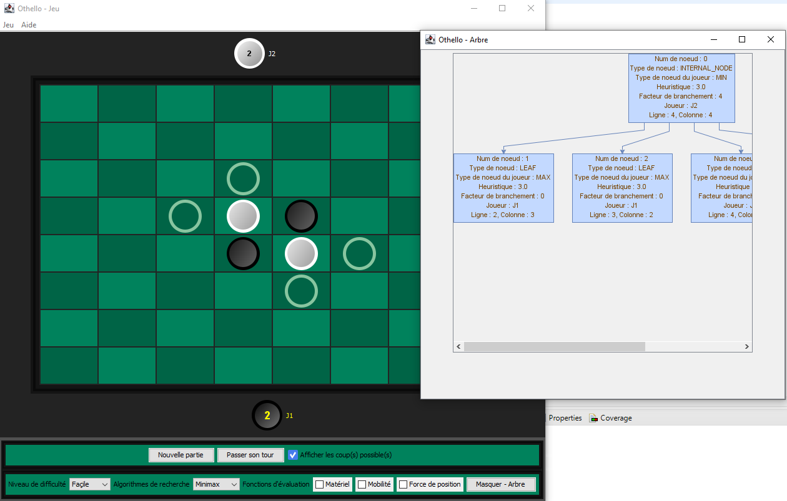

# Othello
Implémentation du jeu Othello (Riversi) afin de mettre en place les algorithmes étudiés dans le module Théorie des Jeux.

# Installation
```maven install```
Ou installer les dépendances jar se trouvant dans le /resources/lib

Bibliothèque utilisée pour le dessin de l'arbre : https://jgrapht.org

# Exécution
OthelloMain

# Exemple



